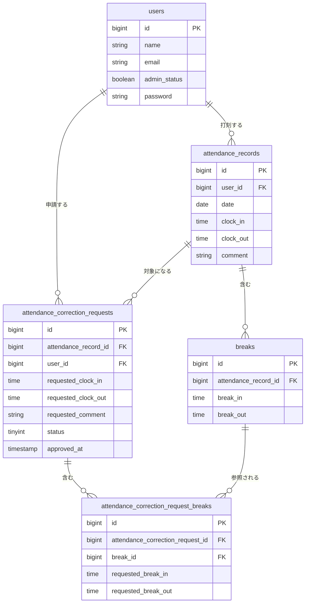

# 勤怠管理システム（コーチテック模擬案件）

## 概要
一般ユーザーが出勤・退勤・休憩を打刻し、勤怠の確認や修正申請を行える勤怠管理アプリです。
管理者は全スタッフの勤怠を確認し、修正申請を承認できます。一般ユーザーと管理者は別ガード（`web` / `admin`）で認証を分離しています。

## 主な機能
- 会員登録・ログイン・ログアウト（一般ユーザー、Laravel Fortify）
- 管理者ログイン・ログアウト
- 勤怠打刻（出勤・退勤・休憩入/戻）
- 勤怠一覧・勤怠詳細の確認
- 勤怠修正申請、申請一覧の確認
- 管理者：日次勤怠一覧、スタッフ一覧・スタッフ別勤怠確認
- 管理者：修正申請の承認
- 動作確認用ダミーデータのシーディング

## 使用技術
- PHP 8.1 / Laravel 10
- Laravel Fortify（認証）
- MySQL 8.4
- Laravel Sail（Docker）
- Vite

## ER図


## 環境構築手順
Docker / Docker Compose がインストールされていることを前提とします。

```bash
git clone <このリポジトリのURL> attendance-app
cd attendance-app
cp .env.example .env

# 初回のみ：vendor が無い状態で Composer 依存関係をインストール
docker run --rm \
  -v "$(pwd):/var/www/html" \
  -w /var/www/html \
  laravelsail/php83-composer:latest \
  composer install --ignore-platform-reqs

./vendor/bin/sail up -d
./vendor/bin/sail artisan key:generate
./vendor/bin/sail artisan migrate --seed
./vendor/bin/sail npm install
./vendor/bin/sail npm run build
```

## ログイン情報（シーダーで作成される検証用アカウント）
| 権限 | メールアドレス | パスワード |
| --- | --- | --- |
| 管理者 | user3@example.com | password |
| 一般ユーザー | user1@example.com | password |
| 一般ユーザー | user2@example.com | password |

- 一般ユーザーのログイン: `/login`
- 管理者のログイン: `/admin/login`

## 開発環境URL
- アプリケーション: http://localhost
- phpMyAdmin: http://localhost:8080
- Mailpit（メール確認用）: http://localhost:8025

## 作成者
[anmerutu3203](https://github.com/anmerutu3203)
